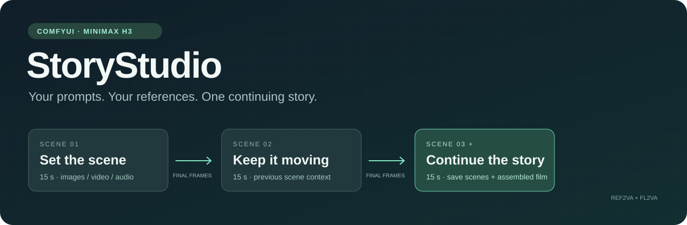
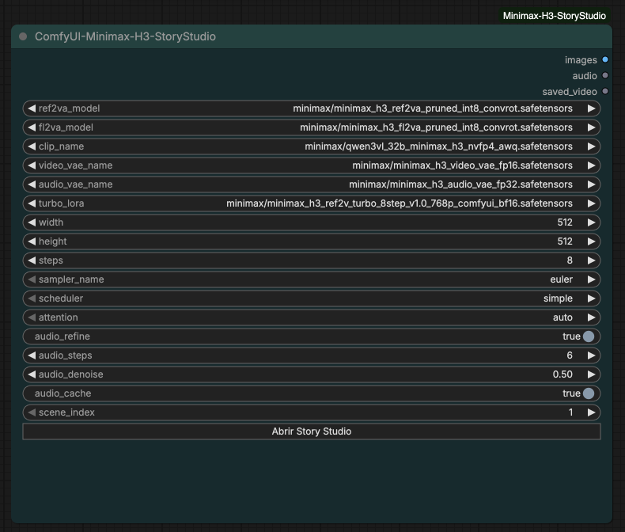
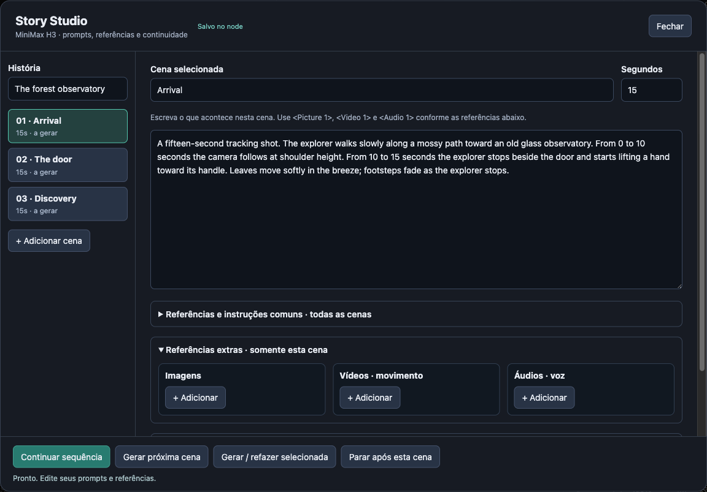
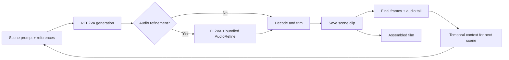

<div align="center">



# ComfyUI-Minimax-H3-StoryStudio

**Build a story in scenes. Keep the final frames. Continue where you left off.**

[](LICENSE)


[Getting started](#getting-started) · [How continuity works](#how-continuity-works) · [AudioRefine fix](#audiorefine-with-the-ram-fix-included) · [Guia em português](docs/GUIA.pt-BR.md)

</div>

StoryStudio brings model selection, scene prompts, media references, temporal continuity and optional audio refinement into one ComfyUI node. Write several scenes of up to **15 seconds each**, add your references inside the scene editor, and let the sequence run through ComfyUI's normal queue.

Each completed scene saves its final frames and audio as context for the next. You get individual clips and an assembled film, with checkpoints for resuming and previous takes preserved when you regenerate a scene.

> Early release. Temporal context helps connect shots; the model still determines identity, motion, dialogue and visual consistency. StoryStudio does not guarantee invisible joins or pixel-identical backgrounds.

## One node, the whole sequence

| Control | What it does |
| --- | --- |
| **Scene editor** | Write prompts, add/remove scenes, choose durations and enable continuation per scene. |
| **Media references** | Upload images, videos and audio for a specific scene or share references across the story. |
| **Model selectors** | Choose installed REF2VA, FL2VA, CLIP, video VAE, audio VAE and Turbo LoRA files. |
| **AudioRefine** | Optional second pass that refines audio while keeping the generated video latent frozen. |
| **Continue / retake / pause** | Resume unfinished scenes, regenerate one take, or stop after the current scene. |
| **Saved results** | Preview each scene, keep previous takes and open the assembled film. |

The main node has **no external `reference_image`, `reference_video` or `reference_audio` ports**. Media belongs to the editor's shared-reference and per-scene sections.



## Getting started

### 1. Check the requirements

- A recent **ComfyUI build with native MiniMax H3 support**, including `MiniMaxH3ReferenceToVideo`, packed audiovisual latents and dynamic graph expansion.
- Compatible **MiniMax H3 model weights**, text encoder and video/audio VAEs. The weights are not included.
- [AIMixer/ComfyUI_MiniMaxH3_Director](https://github.com/AIMixer/ComfyUI_MiniMaxH3_Director), which supplies the temporal motion-context helper.
- **FFmpeg and ffprobe** available on the ComfyUI process's `PATH`; PyAV, NumPy and aiohttp in its Python environment.
- Optional: [ComfyUI-KJNodes](https://github.com/kijai/ComfyUI-KJNodes) and working SageAttention for `attention=auto`. Choose `disabled` to use standard attention.

**AudioRefine is already bundled.** Installing its separate custom-node package is not required for StoryStudio.

### 2. Install

From your ComfyUI directory:

```bash
git clone https://github.com/gabxav/ComfyUI-Minimax-H3-StoryStudio.git custom_nodes/ComfyUI-Minimax-H3-StoryStudio
```

Install the Python dependencies with **the same Python interpreter that runs ComfyUI**:

```bash
python -m pip install -r custom_nodes/ComfyUI-Minimax-H3-StoryStudio/requirements.txt
```

For Windows portable, use `python_embeded\python.exe` from the portable root and adjust the path to `ComfyUI\custom_nodes\ComfyUI-Minimax-H3-StoryStudio\requirements.txt`. Install FFmpeg separately if it is missing.

Restart ComfyUI after the queue finishes, then refresh the browser. Find **ComfyUI-Minimax-H3-StoryStudio** under **MiniMax H3 / StoryStudio**, or import [the example workflow](workflows/story_studio.json).

> Updating an early local build? Keep only one StoryStudio package directory in `custom_nodes`. Move the previous directory outside `custom_nodes` before restarting. Legacy node IDs are retained so existing StoryStudio workflows can still open.

### 3. Select models and write scenes

The example includes three editable forest-observatory scenes and starts at **512 × 512**. It contains no reference media; add your own in the editor. Select model files that actually exist in your installation before generating.

| Asset | Standard ComfyUI location | Role |
| --- | --- | --- |
| REF2VA diffusion model | `models/diffusion_models/` | Initial video and audio generation. |
| FL2VA diffusion model | `models/diffusion_models/` | Audio refinement pass; only loaded when refinement is enabled. |
| H3-compatible text encoder | `models/text_encoders/` | Prompt and reference conditioning. |
| Video VAE + audio VAE | `models/vae/` | Encode context and decode the generated streams. |
| REF2VA Turbo LoRA | `models/loras/` | Optional Turbo sampling recipe; use steps appropriate to your LoRA/model. |

Click **Abrir Story Studio** to open the editor. The interface currently uses Portuguese labels:

| Button | Action |
| --- | --- |
| **Continuar sequência** | Generate from the first missing or outdated scene to the end, then assemble the film. |
| **Gerar próxima cena** | Generate only the next pending scene. |
| **Gerar / refazer selecionada** | Generate a new take of the selected scene. |
| **Parar após esta cena** | Finish the current scene without queuing another. |

The sequence continues on the server after the editor closes. Save the workflow normally in ComfyUI to preserve your edited script. After a server restart, click **Continuar sequência** to resume. Use **Criar nova história a partir desta** for a separate output project.



## References that follow the story

Shared references come first in every scene; the selected scene's extra references follow them. Use the numbering displayed beside each asset in your prompt:

- Images: `<Picture 1>`, `<Picture 2>`, …
- Videos: `<Video 1>`, `<Video 2>`, …
- Audio: `<Audio 1>`, `<Audio 2>`, …

The combined shared + scene limits are **9 images, 3 videos and 3 audio references**. Video/audio entries let you select the starting time and a segment of up to 15 seconds. Reference videos are sampled at 24 fps and limited to 1024 pixels on their longest side.

A video reference supplies visual frames. To use its soundtrack as a voice or sound reference, add that file in the audio column as well.

StoryStudio sends the shared prompt followed by the scene prompt. It does not use an LLM to rewrite dialogue or invent the next scene.

## How continuity works



The default carries **22 frames at 24 fps**, about **0.92 seconds**, plus the corresponding audio tail. The Director helper encodes those actual final frames as temporal conditioning. Your original media references remain part of the conditioning.

After generation, StoryStudio removes the context overlap and the model's extra frames. A 15-second scene exports **360 frames at 24 fps**. The current H3 frame grid is `17k + 5`: internally this uses 362 frames for the first scene and 396 with the default 22-frame continuation context. This internal window exceeds approximately 15 seconds; quality depends on the model and context length.

Changing a scene's prompt, references or generation settings marks affected results as outdated. Regenerating a take also invalidates later scenes that depend on it. Previous files remain available. Renaming a story or scene does not itself invalidate a render.

## AudioRefine with the RAM fix included

StoryStudio bundles [Adudeguyman's ComfyUI-H3-AudioRefine](https://github.com/Adudeguyman/ComfyUI-H3-AudioRefine) **with Gabriel Xavier's persistent RAM cache correction already applied**. No patching of another installed extension is needed.

The original RAM backend allocated persistent tensors in CUDA-pinned host memory. PyTorch's pinned-host allocator can retain freed blocks for the life of the process, causing memory growth across repeated cache builds. The corrected backend uses **pageable CPU memory (`pin_memory=False`)** for persistent tensors. Transfers may be slower than pinned-memory transfers; the change addresses that specific source of host-memory retention.

The vendored files match commit [`34862c6`](https://github.com/gabxav/ComfyUI-H3-AudioRefine/commit/34862c6bf9a85a14495e9ed0e3e21b38c7375999), submitted as [upstream PR #1](https://github.com/Adudeguyman/ComfyUI-H3-AudioRefine/pull/1). The PR was still open when verified on September 5, 2026 UTC. See [provenance, hashes and license](THIRD_PARTY_NOTICES.md).

| Setting | Default | Behavior |
| --- | --- | --- |
| `audio_refine` | On | Run an FL2VA audio pass without the video's Turbo LoRA. |
| `audio_steps` | 6 | Steps in the audio refinement pass. |
| `audio_denoise` | 0.5 | How far the first pass's audio is re-noised. |
| `audio_cache` | On | Use frozen-video cache with `hidden / int4 / auto`; disk caching is disabled. |

Frozen-video caching is an approximation: cached context stops reacting to changing audio between rebuilds. Disable `audio_cache` for an uncached comparison, or disable `audio_refine` to use the first pass's audio. Memory requirements still depend strongly on model, resolution and duration.

The bundled nodes have distinct internal IDs, so the original AudioRefine extension can coexist without having its registrations or files replaced.

## Output and recovery

```text
ComfyUI/output/story_director/<project_id>/
├── cena_001_<revision>.mp4   # exported scene with audio
├── cena_001_<revision>.pt    # final frames and audio context
├── manifest.json            # current takes, script and previous takes
├── job.json                 # sequence progress
└── filme_<revision>.mp4     # assembled film
```

Keep the `.pt` files if you want to continue from saved scenes. The assembled film trims per-clip AAC padding and resets timestamps before joining, avoiding accumulated padding at scene boundaries.

## Validation and limits

The initial workflow was exercised with **three real 15-second scenes at 512 × 512**, including two temporal continuations, audio refinement, retakes, pause/resume and a 45-second assembled film. This is functional validation, not a quality or performance guarantee for every prompt or machine.

Automated checks cover scene invalidation, frame budgets, missing checkpoints, stable recipe hashes, AAC joins, and the bundled RAM store's values, pageable allocation and reference release.

```bash
python -m unittest discover -s tests -v
node --check web/story.js
```

RAM-store tests need the ComfyUI Python environment with ComfyUI importable; ordinary unit tests can run without model weights. AAC assembly tests need FFmpeg and ffprobe. Outside those environments, the corresponding tests report skips.

Not yet validated: hundreds of scenes, every media codec, all H3 quantizations or every ComfyUI release. Exact dialogue, identity and backgrounds remain model-dependent. Custom-node updates may require compatibility adjustments as native H3 APIs evolve.

## Credits and license

Created by [Gabriel Xavier](https://github.com/gabxav). MIT licensed; see [LICENSE](LICENSE).

Built on native [ComfyUI](https://github.com/Comfy-Org/ComfyUI) MiniMax H3 support, [AIMixer's Director](https://github.com/AIMixer/ComfyUI_MiniMaxH3_Director) temporal helper and [Adudeguyman's AudioRefine](https://github.com/Adudeguyman/ComfyUI-H3-AudioRefine). The bundled third-party source retains its original MIT notice in [THIRD_PARTY_NOTICES.md](THIRD_PARTY_NOTICES.md).
